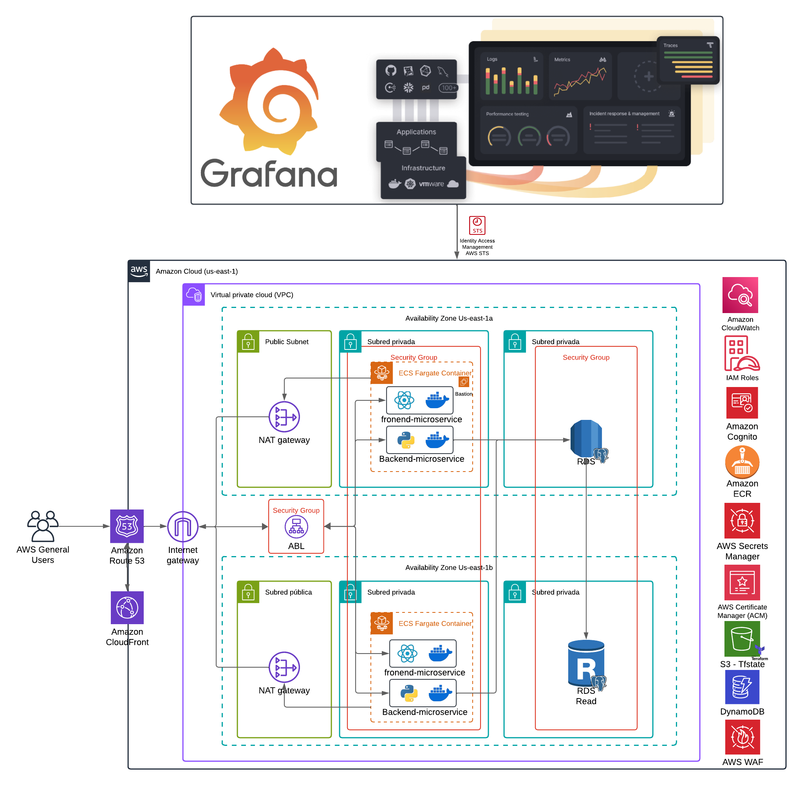

# BLOG CLOUD SECURITY

# README
---

## Tabla de Contenidos
- [Descripción del proyecto](#descripción-del-proyecto)
- [Terraform infrastructure](#terraform-infrastructure)
  - [Requisitos](#requisitos)
  - [Estructura del proyecto](#estructura-del-proyecto)
  - [Configuración](#configuración)
  - [Despliegue](#despliegue)
  - [Componentes principales](#componentes-principales)
  - [Backend de estado](#backend-de-estado)
  - [Variables](#variables)
  - [Seguridad](#seguridad)
- [Base de datos](#base-de-datos)
- [Frontend](#frontend)
  - [Instalación](#instalación-frontend)
  - [Componentes Principales](#componentes-principales)
  - [Páginas](#páginas)
  - [Contexto](#contexto)
- [Cómo Ejecutar el Proyecto](#cómo-ejecutar-el-proyecto)
- [Contacto](#contacto)

---

## Architecture



<!-- BEGIN_TF_DOCS -->

## Descripción del Proyecto
Este repositorio contiene la infraestructura como código para la aplicación **POCBlog**, implementada con **Terraform** para la creación y gestión de recursos en AWS. La arquitectura incluye balanceadores de carga, grupos de escalado automático, bases de datos RDS, subredes, y más.

## Terraform Infrastructure
### Requisitos
- Terraform v1.4.0+
- AWS CLI configurado
- Permisos para crear recursos en AWS (IAM)

| Name | Version |
|------|---------|
| <a name="requirement_terraform"></a> [terraform](#requirement\_terraform) | >=1.4.0 |
| <a name="requirement_aws"></a> [aws](#requirement\_aws) | >=1.4.0 |

### Estructura del Proyecto
.
├── components        # Módulos de Terraform para los recursos
│   ├── alb.tf       # Application Load Balancer
│   ├── ecs.tf       # Cluster ECS
│   ├── rds.tf       # RDS Database
│   ├── security-group.tf # Grupos de Seguridad
│   ├── s3.tf        # Almacenamiento S3
│   └── variables.tf # Variables
├── tfstate          # Configuración para almacenamiento remoto del estado
├── main.tf          # Configuración principal
├── terraform.tfvars # Valores de variables
└── provider.tf      # Configuración de proveedore

### Configuración
1. Configura las credenciales de AWS con el siguiente comando:
   ```bash
   aws configure
   ```
2. Define las variables necesarias en el archivo `terraform.tfvars`.
3. Modifica las variables del entorno si es necesario.

### Despliegue

**Inicializar el Proyecto**
```bash
terraform init
```
**Validar la Configuración**
```bash
terraform validate**
```
**Planificar el Despliegue**
```bash
terraform plan
```
**Aplicar el Despliegue**
```bash
terraform apply
```

### Componentes principales
- **VPC**: Red privada virtual para la infraestructura.
- **ALB (Application Load Balancer)**: Balanceo de carga para distribuir tráfico.
- **ECS (Elastic Container Service)**: Ejecución de contenedores Docker.
- **RDS (Relational Database Service)**: Base de datos PostgreSQL.
- **S3**: Almacenamiento para archivos de configuración.
- **IAM Roles y Policies**: Permisos para servicios AWS.
- **Security Groups**: Control de tráfico de red.

### Backend de Estado
La configuración de estado remoto se gestiona con S3 y bloqueo con DynamoDB.
**Configuración**
- S3 Bucket: `infraestructura-pocblog`
- DynamoDB Table: `pocblog-locks`

### Variables
Las variables de entorno están definidas en **variables.tf** y se asignan en **terraform.tfvars**. 
Ejemplos:
```bash
project_name = "pocblog"
environment  = "dev"
vpc_cidr     = "10.0.0.0/16"
region       = "us-east-1"
```

### Seguridad
- Cifrado de secretos con **AWS Secrets Manager**.
- Roles de IAM con permisos mínimos necesarios.
- Buckets S3 con versionado habilitado.
- Grupos de seguridad para restringir tráfico.


## Modules

| Name | Source | Version |
|------|--------|---------|
| <a name="module_components"></a> [components](#module\_components) | ./components | n/a |

## Resources

No resources.

## Inputs

| Name | Description | Type | Default | Required |
|------|-------------|------|---------|:--------:|
| <a name="input_architecture"></a> [architecture](#input\_architecture) | ecs cpu architecture | `string` | n/a | yes |
| <a name="input_database_instance_class"></a> [database\_instance\_class](#input\_database\_instance\_class) | database instance type | `string` | n/a | yes |
| <a name="input_database_instance_identifier"></a> [database\_instance\_identifier](#input\_database\_instance\_identifier) | database instance identifier | `string` | n/a | yes |
| <a name="input_env_file_bucket_name"></a> [env\_file\_bucket\_name](#input\_env\_file\_bucket\_name) | s3 bucket name | `string` | n/a | yes |
| <a name="input_env_file_name"></a> [env\_file\_name](#input\_env\_file\_name) | env file name | `string` | n/a | yes |
| <a name="input_environment"></a> [environment](#input\_environment) | environment | `string` | n/a | yes |
| <a name="input_image_name"></a> [image\_name](#input\_image\_name) | the docker image name | `string` | n/a | yes |
| <a name="input_image_tag"></a> [image\_tag](#input\_image\_tag) | the docker image tag | `string` | n/a | yes |
| <a name="input_multi_az_deployment"></a> [multi\_az\_deployment](#input\_multi\_az\_deployment) | create a standby db instance | `bool` | n/a | yes |
| <a name="input_private_app_subnet_az1_cidr"></a> [private\_app\_subnet\_az1\_cidr](#input\_private\_app\_subnet\_az1\_cidr) | private app subnet az1 cidr block | `string` | n/a | yes |
| <a name="input_private_app_subnet_az2_cidr"></a> [private\_app\_subnet\_az2\_cidr](#input\_private\_app\_subnet\_az2\_cidr) | private app subnet az2 cidr block | `string` | n/a | yes |
| <a name="input_private_data_subnet_az1_cidr"></a> [private\_data\_subnet\_az1\_cidr](#input\_private\_data\_subnet\_az1\_cidr) | private data subnet az1 cidr block | `string` | n/a | yes |
| <a name="input_private_data_subnet_az2_cidr"></a> [private\_data\_subnet\_az2\_cidr](#input\_private\_data\_subnet\_az2\_cidr) | private data subnet az2 cidr block | `string` | n/a | yes |
| <a name="input_project_name"></a> [project\_name](#input\_project\_name) | project name | `string` | n/a | yes |
| <a name="input_public_subnet_az1_cidr"></a> [public\_subnet\_az1\_cidr](#input\_public\_subnet\_az1\_cidr) | public subnet az1 cidr block | `string` | n/a | yes |
| <a name="input_public_subnet_az2_cidr"></a> [public\_subnet\_az2\_cidr](#input\_public\_subnet\_az2\_cidr) | public subnet az2 cidr block | `string` | n/a | yes |
| <a name="input_publicly_accessible"></a> [publicly\_accessible](#input\_publicly\_accessible) | controls if instance is publicly accessible | `bool` | n/a | yes |
| <a name="input_region"></a> [region](#input\_region) | region to create resources on AWS | `string` | n/a | yes |
| <a name="input_secrets_manager_secret_name"></a> [secrets\_manager\_secret\_name](#input\_secrets\_manager\_secret\_name) | the secrets manager secret name | `string` | n/a | yes |
| <a name="input_vpc_cidr"></a> [vpc\_cidr](#input\_vpc\_cidr) | vpc cidr block | `string` | n/a | yes |

## Outputs

No outputs.
<!-- END_TF_DOCS -->

## Authors
- Yeimy Valencia
- Oscar Giraldo
- Nicolás Pico García
